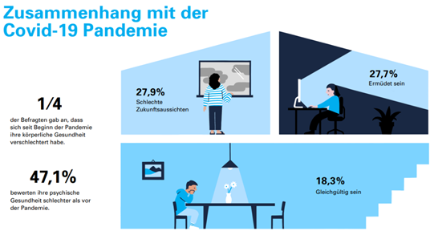

+++
title = "Faul oder krank? – Was ist mit den Schülern und Schülerinnen von heute los?"
date = "2024-05-08"
draft = false
pinned = false
tags = ["Deutsch", "Reportage"]
description = "Ist die psychische Gesundheit von Jugendlichen in der Schweiz in Gefahr? Psychologen und Psychologinnen in der Schweiz sind alarmiert. Was kann dagegen unternommen werden?"
+++
**Irini Gayed, Aline Bouquet**

«Es ist schon manchmal Bedenken im Raum wie entwickeln sich diese jugendlichen Kinder dann weiter ins Erwachsenenalter. Wie gut kommen sie später klar?» so Dr. med. Verena Amrein-Zürcher, Fachärztin FMH für Kinder- und Jugendpsychiatrie und -psychotherapie, auf die Frage, wie sie die Zukunft der Betroffenen sieht, als wir sie in ihrem gemütlich eingerichteten Haus in einem ruhigen Quartier in Bern besuchen. Grund zu solch einer Aussage hat sie allemal, denn psychische Krankheiten entstehen oft im jungen Alter; viele Betroffene haben schlechte Kindheitserfahrungen gemacht.

Als wir mit ihr an ihrem Küchentisch ein Gespräch führen und die Stimmung sehr angenehm ist, erklärt sie uns ebenfalls, dass es schwierig sei, diese Problematik auf einen Grund zurückzuführen, denn es sei ein Zusammenspiel von vielen Faktoren wie beispielsweise soziale Medien, gesellschaftlicher Leistungsdruck oder Mobbing. Dies bestätigt auch eine Studie von Unicef-Schweiz, in welcher es heisst: «Die grössten Risikofaktoren, welche die Studie in der Schweiz und Liechtenstein identifizieren konnte, sind schwierige Familienverhältnisse, ein tiefer sozioökonomischer Status, schlechte Kindheitserfahrungen sowie chronische Leiden».

## Zusammenhang mit der Covid-Pandemie

Zudem entpuppte sich laut Unicef-Schweiz die Covid-Pandemie als möglicher Treiber zu schlechter psychischer Gesundheit. Laut Dr. med. Amrein-Zürcher habe die Pandemie «das Ganze noch beschleunigt», zwar habe man schon gesehen, dass die Zahlen damals hochgegangen seien, aber man könne den Anstieg der Erkrankungen nicht nur darauf zurückführen: «Jetzt kann man nicht einfach mehr sagen, ja es ist wegen Covid, das hat einen Peak gegeben, aber es hört nicht auf, sondern es geht einfach immer weiter und weiter nach oben», erläutert Dr. med. Amrein-Zürcher weiter.

Auch bei einer Studie der Unicef-Schweiz kamen weitere erschreckende Zahlen zum Vorschein, nämlich stellte sich heraus, dass von den 1097 Teilnehmenden aus der Schweiz und aus Liechtenstein im Alter zwischen 14 und 19 Jahren, 37 Prozent von psychischen Krankheiten betroffen sind. Von allen Befragten gaben 17 Prozent der Jugendlichen, welche Anzeichen von Angststörungen und/oder Depressionen aufweisen, an, versucht zu haben, sich das Leben zu nehmen, rund 48 Prozent davon haben mehrere Suizidversuche unternommen. Insgesamt gab jeder elfte aller Befragten an, versucht zu haben, sich das Leben zu nehmen.

Unicef-Schweiz berichtet, dass dies zudem Folgen auf das Suchtverhalten der Jugendlichen hat, wie beispielsweise Rauchen, Alkohol- oder Cannabiskonsum.

## Die Situation ist prekär, besonders für Betroffene

«Ich musste ein halbes Jahr warten, bis ich einen Platz bekommen habe», damit spricht die 18-jährige Laura K. den Fachpersonenmangel und die langen Wartezeiten an. Sie berichtet weiter, dass sobald man im System drinnen sei, die Wartezeiten kürzer werden und man weitergereicht werde. Wir unterhalten uns mit ihr per Telefon, da ein Treffen nicht möglich war, trotzdem bekommen wir einen Eindruck über ihre Person, ihre Erfahrungen mit dem psychotherapeutischen System der Schweiz und ihrem Weg in diesem. Laura erscheint uns sehr hilfsbereit und offen.

«Es ist alles überlastet, ich habe täglich Anfragen, oft mehrere am Tag und ich kann vielleicht ein bis zwei Neuaufnahmen pro Monat nehmen, da kann man sich etwa vorstellen wie viele, dass da am Suchen sind.» 

* Dr. med. Verena Amrein-Zürcher

